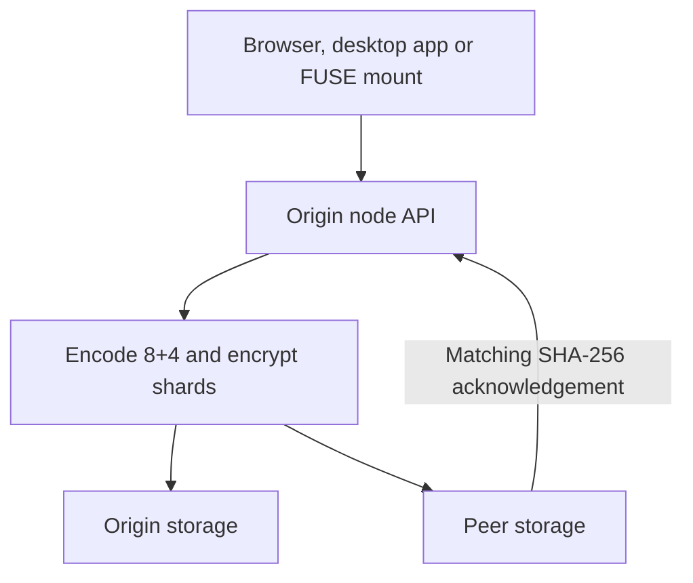

# CollectiveFS

CollectiveFS stores files across independently operated nodes. Full nodes split
files into Reed–Solomon shards, encrypt each shard with Fernet, and verify copies
before handing storage to peers. Android apps can embed a private local replica.

## Start here

| I want to… | Read |
| --- | --- |
| Build or run a node | [Building](docs/BUILDING.md) |
| Understand storage, recovery and APIs | [Architecture](docs/ARCHITECTURE.md) |
| Embed storage in an Android app | [Android](docs/ANDROID.md) |
| Run checks against disposable data | [Testing](docs/TESTING.md) |
| Review measured performance and proposals | [Performance analysis](docs/PERFORMANCE.md) |
| Read the original prototype design | [Historical design](DESIGN.md) |

## Run a node

Docker builds the UI and Linux encoder/decoder inside the image:

```bash
docker compose up -d --build
curl -fsS http://localhost:8010/api/health
```

Open **http://localhost:8010/** for the file browser. The `collective_data` volume
holds the node's key, identity, metadata and shards; back up the whole volume.

For local development:

```bash
python3 -m venv .venv
source .venv/bin/activate
python -m pip install -r requirements-test.txt
make build
make test
```

[Building](docs/BUILDING.md) lists prerequisites, API startup and cluster commands.

## Where a file goes



| Rule | Meaning |
| --- | --- |
| Default layout: 8 data + 4 parity | Any 8 valid shards can reconstruct the file. |
| At most 4 shards per peer with the default layout | Losing one storage peer stays within the parity budget. |
| Verify a peer's digest before dropping the local shard | Failed transfers retain the origin's copy. |
| Keep the origin's key and metadata | Shards alone do not replace an origin backup. |
| Android shards stay local | The embedded node uses AES-256-GCM; apps replicate portable file contents over HTTP. |

Configure peering in `.env` using [.env.example](.env.example):

| Setting | Purpose |
| --- | --- |
| `CFS_OWN_URL` | This node's address, reachable by other peers. |
| `CFS_PEER_URLS` | Comma-separated peer addresses to announce to. |
| `CFS_PORT` | Published host port; default `8010`. |

## Interfaces

| Interface | What it provides |
| --- | --- |
| Web and desktop console | Folder navigation, upload/download, previews, search, list/grid views, performance and settings. |
| FUSE mount | A shared account namespace at `/media/collectivefs`; writes upload on close. |
| HTTP API | Files, folders, peer storage, quota, contracts and telemetry. |
| Embedded Android node | Loopback file API, private app storage and a 512 MiB default quota. |
| Legacy React console | Section dashboards and agent chats; retained as the API's UI fallback. |

## Measure performance

`make eval-mount` exercises throughput, latency, concurrent access, reconciliation,
shard placement, degraded reads, contracts and quota on the configured mounted
cluster. It writes [a Markdown report](benchmarks/results/mount-eval.md) and raw
JSON. See [Testing](docs/TESTING.md) before running checks that change stored data.

## License

CollectiveFS is [GPL-2.0-only](LICENSE). Bundled third-party code keeps its own
license; [reedsolomon](reedsolomon/LICENSE), for example, is MIT-licensed.
