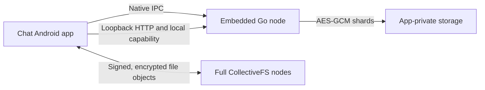

# CollectiveFS on Android

`lib/mobile` is the storage node embedded in Chat's Android foreground service.
It runs inside the app process with private storage and a stable node UUID.
No Docker, Python, FUSE or root is needed.

## Storage and access

| Property | Behavior |
| --- | --- |
| Erasure coding | 8 data + 4 parity shards; up to 4 missing or corrupt shards can be reconstructed. |
| Encryption | AES-256-GCM for each local shard. |
| Integrity and metadata | SHA-256 checks and atomic metadata commits. |
| Quota | 512 MiB by default; configurable through `quotaBytes`. |
| Keys | Protected by the Android app sandbox; existing keys are never silently replaced. |
| Listener | Loopback only; an ephemeral port by default. |
| Local authorization | Every request needs the private `X-CFS-Local-Key` returned through native IPC. |
| Account isolation | `X-CFS-Token` selects the namespace; reads never cross namespaces. |



The mobile node implements upload, metadata, download, file-tree and stats APIs.
Chat copies its encrypted objects between local and full nodes; mobile shards
stay on the device. The portable HTTP file contents work with both node types.

| Full nodes provide | Mobile node provides |
| --- | --- |
| Peering, Fernet shards, contracts, repair and FUSE | An on-device replica through the local file API |
| Network-reachable service | Loopback service authorized by a private capability |

## Storage identity and person identity

| Identity | Scope |
| --- | --- |
| Node UUID | One storage installation; linked devices each keep their own. |
| Chat identity UUID | UUIDv8 derived from SHA-256 of `collectivefs-identity-v1:<Ed25519 public key in base64url>`. |
| Chat fingerprint | SHA-256 of the raw signing public key. |
| Public identity card | Signed public details; no private key or workspace access settings. |

Linked devices share the same private Chat identity. A device transfer is
encrypted to the requesting device's ephemeral Curve25519 key, signed by the
existing identity, bound to its request and valid for ten minutes.

## Build and test on Linux

```sh
cd lib
go test -race ./mobile ./cmd/mobile-node
go run ./cmd/mobile-node --root /tmp/cfs-test-node --listen 127.0.0.1:8012
```

## Embed in Android

Build with Go and Android NDK r28+:

```sh
cd lib
NDK_HOME=/path/to/android-ndk ./android/build.sh /tmp/cfs-jniLibs
```

1. Copy `lib/android/org/collectivefs/mobile/Node.java` into the app's Java sources.
2. Copy the generated libraries into its `jniLibs` directory.
3. Have the host app manage Android service and notification lifecycle.

| Native call | Result |
| --- | --- |
| `Node.start(configJson)` | Starts the node using required `root`, optional loopback `listen` and optional `quotaBytes`. |
| `Node.state()` | Returns private IPC status and the local capability. |
| `Node.stop()` | Closes the node. |

For Termux diagnostics, cross-build `./cmd/mobile-node` with
`GOOS=android GOARCH=arm64 CGO_ENABLED=1 CC=<NDK aarch64 clang> go build`.
Use an app-private root. `runtime.json` has mode `0600` and contains the local
capability; keep it private.
