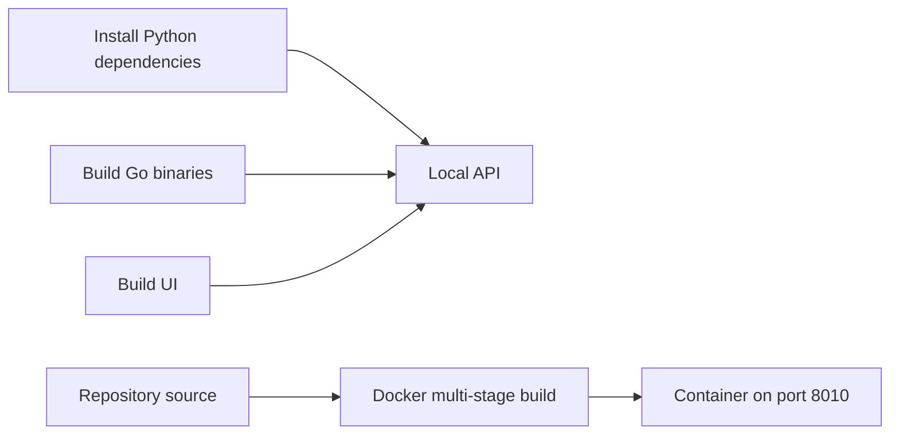

# Building CollectiveFS

## Prerequisites

| Tool | Version | Check with |
|------|---------|------------|
| Python | 3.10+ | `python3 --version` |
| Go | 1.22+ | `go version` |
| Node.js and npm | Node 20+ for the console build | `node --version; npm --version` |
| Docker | 20+ | `docker --version` |
| Docker Compose | v2 | `docker compose version` |
| Make | any | `make --version` |

> **macOS note:** On macOS you may need to use `python3` and `pip3` (or
> `python3 -m pip`) instead of `python` and `pip`.

## Quick start

```bash
# Clone the repo
git clone https://github.com/physiii/CollectiveFS.git
cd CollectiveFS

# Create a virtual environment (recommended)
python3 -m venv .venv
source .venv/bin/activate   # on macOS/Linux
# .venv\Scripts\activate    # on Windows

# Install Python dependencies
pip install -r requirements-test.txt

# Build Go encoder/decoder and the console UI
make build

# Run unit tests to verify
make test
```

The binaries and UI are built. [Start the API](#3-run-the-api-server-single-node)
for a local node, or use [Docker](#4-run-with-docker-single-node).



## Step by step

### 1. Build the Go binaries

The encoder and decoder are Go programs that handle Reed-Solomon erasure coding.

```bash
make build-go
```

This produces two binaries under `lib/`:
- `lib/encoder` — splits files into data + parity shards
- `lib/decoder` — reconstructs files from available shards

Verify they work:

```bash
# Encode a test file
echo "hello world" > /tmp/test.txt
./lib/encoder -data 4 -par 2 -out /tmp /tmp/test.txt

# Delete one shard to simulate loss
rm /tmp/test.txt.2

# Decode (should reconstruct successfully)
./lib/decoder -data 4 -par 2 -out /tmp/recovered.txt /tmp/test.txt
cat /tmp/recovered.txt
# => hello world
```

### 2. Install Python dependencies

```bash
# For running the service:
pip install -r requirements.txt

# For running tests (includes the above):
pip install -r requirements-test.txt
```

> If you skipped the virtual-environment step in Quick Start, prefix
> commands with `python3 -m pip` instead of bare `pip`.

### 3. Run the API server (single node)

```bash
python -m uvicorn api.main:app --host 0.0.0.0 --port 8000
```

Then open http://localhost:8000/api/health — you should see `{"status":"ok","version":"0.1.0"}`.

### 4. Run with Docker (single node)

The Dockerfile builds the UI and Linux Go binaries in separate build stages.
Host-built binaries are not mounted into these containers. Docker builds work
without running `make build` first, including on macOS.

```bash
docker compose up -d --build
curl -fsS http://localhost:8010/api/health
```

### 5. Run a 3-node cluster

```bash
# Build and start
docker compose -f docker-compose.cluster.yml up -d --build

# Verify all nodes are healthy
curl http://localhost:8001/api/health
curl http://localhost:8002/api/health
curl http://localhost:8003/api/health

# Upload a file to node1
curl -F "file=@README.md" http://localhost:8001/api/files/upload

# List files on node1
curl http://localhost:8001/api/files

# Stop the cluster and keep its data volumes
docker compose -f docker-compose.cluster.yml down
```

## Makefile targets

| Target | What it does |
|--------|-------------|
| `make build` | Build Go encoder/decoder and console UI |
| `make build-go` | Build only Go encoder/decoder binaries |
| `make build-ui` | Install UI dependencies and build the console bundle |
| `make build-docker` | Build Docker images for the cluster |
| `make install` | Install Python dependencies (including test deps) |
| `make test` | Run unit tests |
| `make test-eval` | Run evaluation tests (requires Go binaries) |
| `make test-cluster` | Run cluster tests (requires Docker) |
| `make test-all` | Run unit + eval tests |
| `make clean` | Remove binaries, caches, cluster containers **and cluster data volumes** |
